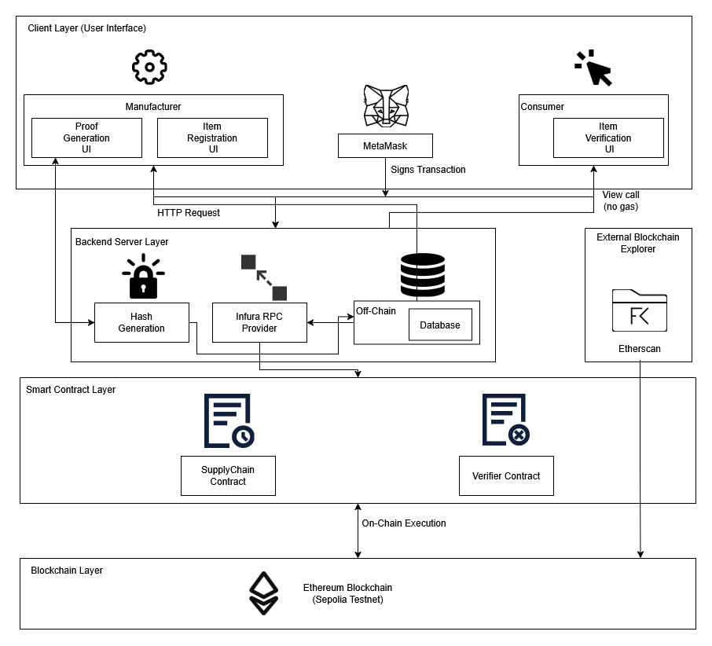
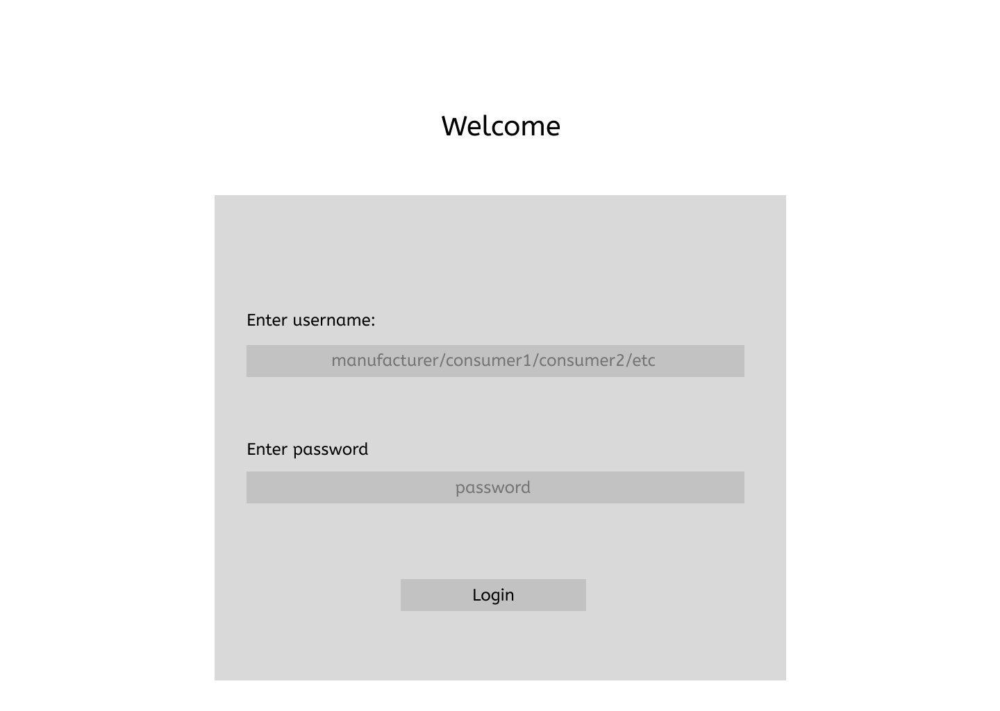

# Blockchain Verification System

## Overview:
This is a blockchain-based verification system designed to ensure the authenticity, integrity, and immutability of digital records. By leveraging decentralized ledger technology and cryptographic proofs, the system enables users to verify documents, transactions, or data entries without relying on a centralized authority. The platform focuses on transparency, trust, and tamper-resistance while remaining easy to integrate with existing applications.

---

## Problem It Solves

In traditional systems, verification of records depends on centralized intermediaries (institutions, databases, or third-party authorities). These systems suffer from several issues:

* Risk of data tampering or unauthorized modification
* Single point of failure and security breaches
* Lack of transparency in verification processes
* High cost and time delays for manual verification

This project eliminates these issues by providing a decentralized, cryptographically secure method to prove that data has not been altered and was recorded at a specific point in time.

---

## Target Users (Personas)

### 1. Organizations & Enterprises

* Use case: Verifying certificates, contracts, audit logs, and compliance records
* Pain point: Trusting external verification agencies and managing large volumes of sensitive data

### 2. Developers & System Integrators

* Use case: Integrating verification APIs into applications (education platforms, supply chain systems, fintech apps)
* Pain point: Building secure and scalable verification mechanisms from scratch

### 3. End Users / Verifiers

* Use case: Checking the authenticity of documents or transactions
* Pain point: Difficulty in confirming whether a document is genuine or has been altered

---

## Vision Statement

To build a trusted, decentralized verification platform that enables anyone to prove and validate the authenticity of digital information instantly, securely, and transparently—without depending on centralized authorities.

---

## Key Features / Goals

* **Immutable Record Storage:** Store cryptographic hashes of data on the blockchain to ensure tamper-proof verification
* **Decentralized Verification:** No single authority controls or alters the verification process
* **Timestamped Proofs:** Provide verifiable proof of when data was recorded
* **Easy Verification Interface:** Simple web or API-based verification for non-technical users
* **Scalable Architecture:** Support high transaction volumes with minimal latency
* **Security by Design:** Strong cryptography and secure key management

---

## Success Metrics

* Number of records successfully verified on the blockchain
* Verification accuracy (zero or near-zero false verification results)
* System uptime and reliability
* Transaction confirmation time
* Adoption rate by organizations and developers

---

## Assumptions & Constraints

### Assumptions

* Users have basic access to internet and blockchain-compatible infrastructure
* Blockchain network used is reliable and secure
* Users trust cryptographic proofs for verification

### Constraints

* Blockchain transaction costs (gas fees)
* Scalability limitations of the chosen blockchain network
* Regulatory and legal compliance requirements
* Performance trade-offs between decentralization and speed

---

This vision document serves as the foundation for designing, developing, and evolving this system in alignment with its long-term goals.


This repository contains the Zero-Knowledge Proof (ZKP) project setup, Docker configuration, and instructions for local development.

---

## Software Design

### Architecture Diagram:


The editable source draw.io file can also be found in the design folder.

### Figma
These wireframes represent only the skeletal design, and not the actual final UI screens.
[Prototype link](https://www.figma.com/proto/pxrp0SrQPKZ2ua2QBz5laM/ZKP-system?node-id=37-14&p=f&t=zvj4oiTxtmgFB0W1-1&scaling=scale-down&content-scaling=fixed&page-id=17%3A152&starting-point-node-id=37%3A14&show-proto-sidebar=1).

### Prototype flow instructions:
* In the Welcome page, click the username section, and press 'm' for Manufacturer and 'c' for Consumer in your keyboard to go to Manufacturer and Consumer pages respectively.
#### Manufacturer section:
* Click either the Hash Page or Item Page
##### Hash Page
* Click the 'Get Hashes' button to simulate giving connecting to metamask, getting user inputs, and downloading the hashes json file from the system.
##### Item Page
* Click the 'Register Item' button to simulate filling all the necessary user inputs and then registerting
* Click the MetaMask popup section to simulate approving the transaction for gas fees
* Item is then registered

#### Consumer section:
* Click the "Verify Item" button to simulate filling all the necessary user inputs and then verifying the item.

Welcome Page:


##### Manufacturer Pages:


##### Consumer Pages:


The user interface was designed with a consistent, minimalistic layout across all modules to ensure clarity and ease of navigation. Clear button labels, logical step-by-step workflows, and immediate visual feedback (e.g., success messages and hash outputs) were implemented to reduce user confusion and increase transparency. MetaMask integration was made explicit to reinforce trust and ensure users understand when blockchain transactions and gas confirmations occur.

---

## Branching Strategy

We are following **GitHub Flow** for our development process:

1. **Main Branch (`main`)**  
   - Always contains the stable, production-ready code.
2. **Feature Branches**  
   - Each new feature or experiment is developed in a separate branch, e.g., `feature/docker-setup`.  
   - Pull Requests (PRs) are created to merge feature branches into `main` once they are tested and approved.
3. **Merging**  
   - All changes are merged into `main` via PRs.  
   - Fast-forward merges are preferred to maintain a clean history.

**Example:**  
- `main` → stable branch  
- `feature/docker-setup` → branch for Docker configuration  
- Screenshots of branches in GitHub can be found in `/design/old_docker/branches.png`

---

## Local Development Tools

The project uses the following tools for local development:

| Tool                  | Version | Purpose |
|-----------------------|---------|---------|
| Node.js               | 18.x    | JavaScript runtime environment |
| npm                   | 11.x    | Package management |
| Docker Desktop         | Latest  | Containerization and local environment |
| VS Code               | Latest  | IDE for coding and terminal access |
| Express.js            | Latest  | Lightweight web server (for local testing) |

---

## Quick Start – Local Development

Follow these steps to get the project running locally using Docker:

### 1. Install Docker Desktop

- Download from: [https://www.docker.com/products/docker-desktop](https://www.docker.com/products/docker-desktop)  
- Install and ensure Docker is running. Verify with:

```bash
docker --version
docker-compose --version
```

### 2. Clone the Repository
```bash
git clone https://github.com/YOUR_USERNAME/zkp-system.git
cd zkp-system
```

### 3. Build and Run Docker Container
```bash
docker-compose up --build
```
The docker-compose.yml will:
-Build the Docker image from the Dockerfile
-Start the container named zkp-container
-Map port 3000 from container to host
If successful, you should see:
`zkp-container | ZKP Docker container running successfully!`
### 4. Access the App in Browser
Open your browser and navigate to:
```bash
http://localhost:3000
```
You should see:
`ZKP Docker container running successfully!`

### 5. Stop the Container
```bash
docker-compose down
```

---

## Screenshots (Proof of Setup)

- Docker build and run success:  
  
- App running on localhost:  
  
- GitHub branches showing feature branch:  
  

